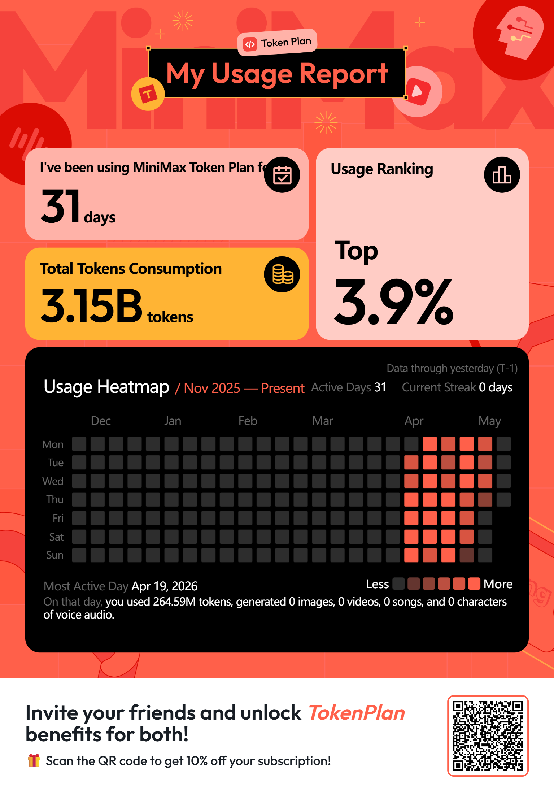

# Hi, I'm Adi Syafriadi

## About Me

AI Agent Engineer focused on building autonomous coding agents with **[pi.dev](https://pi.dev)** and **MiniMax M2.7**.

### What I Build

- **[pi-minimax-pack](https://github.com/adi805/pi-minimax-pack)** — Global engineering contract + skills for pi.dev with auto-grind verification
- **[hermes-agent-minimax](https://github.com/adi805/hermes-agent-minimax)** — Multi-channel AI agent gateway (Webhook + Telegram)
- **[SoftwareSawit](https://github.com/adi805/SoftwareSawit)** — Palm oil plantation management system

### Tech Stack

- **AI/LLM**: MiniMax M2.7, pi.dev, prompt engineering, agent orchestration
- **Backend**: Python, Node.js, FastAPI, Express
- **Frontend**: React, Next.js, Tailwind CSS
- **DevOps**: Docker, CI/CD, Linux VPS

### MiniMax API

I use MiniMax's AI models for multimodal generation (image, video, audio, TTS) in my AI agent workflows.

**Get started with MiniMax:** [View Token Plans](https://platform.minimax.io/subscribe/token-plan?code=1DFnA0fl4f&source=link)

---

*Building autonomous AI agents, one commit at a time.*
